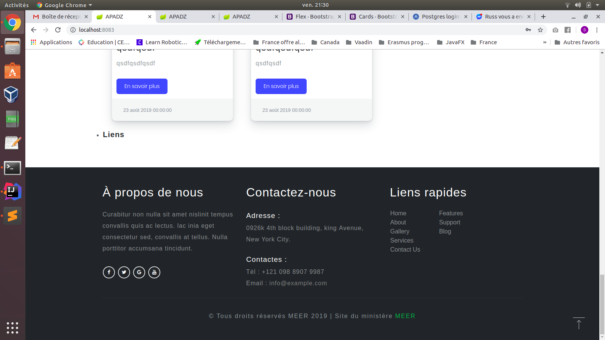

# apadz
Projet pluridisciplinaire APADZ

# Apperçu:

# Afin que le projet puisse fonctionner, j'ai du modifier beaucoup de fichiers et rajouté d'autres qui n'ont rien à avoir avec ma partie, et dans ce cas là, si je devrai mettre mon travail dans la branche du projet principale je devrai modifier également d'autres fichiers dans la branche principale (ce qui n'est généralement pas souhaitable pour le chef du projet).

# De ce fait je pense que l'intégration devra se faire par une autre personne.
# Néanmoins je partage ma partie fonctionnelle à 100% dans ce répertoire, et je liste les fichiers que j'ai modifié ainsi que ceux que j'ai rajouté afin que le projet fonctionne comme prévu.

# Si besoin de plus de justifications détaillées concernant le pourquoi de modification ou d'ajout de chaque fichier, vous me questionnez et je vous expliquerez.

  - com.projet.ressources.security.AuthenticationProvider
  - com.projet.ressources.models.metier.presentation.repositories.CategorieArticleRepository
  - com.projet.ressources.models.metier.presentation.repositories.ArticleRepository
  - com.projet.ressources.models.metier.presentation.Listeners.ArticleRepositoryListener
  - com.projet.ressources.security.SecurityConfiguration
  - com.projet.ressources.models.beans.Compte
  - com.projet.ressources.models.beans.articles.CategorieArticle
  - com.projet.ressources.models.beans.articles.Article
  - com.projet.ressources.security.UserPrincipalDetailsService
  - com.projet.ressources.RessourceGenetiqueApplicationTests
  - pom.xml (j'ai rajouté des librairies très pratiques Lombok, Spring data-rest)
  - application.properties (le dialect de postgres est obligatoire pour une application utilisant hibernate...)
  - Resource Bundle 'messages' (pour l'internationalisation surtout !)
  - fichiers js / css / html (sans détailler le tout)
  
# Je tiens à préciser que le projet ne fonctionnera pas si ces modifications ne figurent pas dans le projet, et qu'il fonctionne à merveille actuellement.

# A titre d'éxemple: l'ancien AuthenticationProvider lève une éxception de type NullPointerException lorsque l'utilisateur n'est pas trouvé lors de la recherche d'un compte pour l'authentification, et donc la session plante, et la réponse http n'est pas retourné au client ce qui fait que le navigateur reste figé et lève une erreur 404 (comme quoi la resource demandé n'est pas présente en raison d'une erreur d'execution => NullPointerException)
